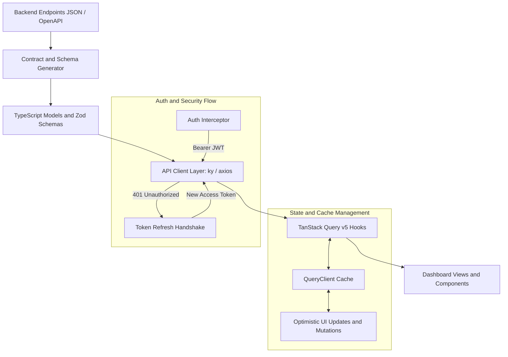

# API Integration Plan and Architecture Strategy

This document outlines the technical blueprint, library selection, and implementation roadmap for integrating the Lernova Admin Dashboard with the backend API.

---

## 1. Architectural Overview



---

## 2. Recommended Technologies and Libraries

### Core Data Fetching and Caching

| Tool                      | Version                          | Role and Justification                                                                                                 |
| :------------------------ | :------------------------------- | :--------------------------------------------------------------------------------------------------------------------- |
| **@tanstack/react-query** | `^5.101.1` _(Already Installed)_ | Industry-standard declarative async state management, caching, background revalidation, and mutation handling.         |
| **ky**                    | Modern Fetch Client              | Lightweight Fetch-based HTTP client with hook-based interceptors, built-in retry logic, and zero runtime dependencies. |
| **Zod**                   | `^3.25.76` _(Already Installed)_ | Runtime schema validation to guarantee API payload integrity and type inference across all response models.            |

### Contract-Driven Code and Type Generation (When JSON is Provided)

| Tool                                       | Purpose                                                                                                                          |
| :----------------------------------------- | :------------------------------------------------------------------------------------------------------------------------------- |
| **openapi-typescript** / **openapi-fetch** | If the endpoints JSON is in OpenAPI / Swagger 3.0+ format, this generates typed query functions with zero runtime overhead.      |
| **Orval** _(Optional)_                     | Generates ready-to-use TanStack Query hooks, query keys, and mock MSW handlers directly from OpenAPI JSON.                       |
| **quicktype / json-to-ts**                 | If the JSON is a custom endpoint list or sample response payloads, this generates strong TypeScript interfaces with Zod parsers. |

### UI Feedback Layer

| Tool             | Version                          | Purpose                                                                              |
| :--------------- | :------------------------------- | :----------------------------------------------------------------------------------- |
| **sonner**       | `^2.0.7` _(Already Installed)_   | Toast notifications for mutation successes, network timeouts, and permission errors. |
| **lucide-react** | `^0.575.0` _(Already Installed)_ | Status icons (loading spinners, alert badges, checks).                               |

---

## 3. Directory Structure

```text
src/
├── api/
│   ├── client.ts              # HTTP client instance with interceptors, base URL and auth headers
│   ├── types/                 # TypeScript interfaces generated from the endpoints JSON
│   │   ├── auth.ts
│   │   ├── courses.ts
│   │   ├── students.ts
│   │   ├── analytics.ts
│   │   └── index.ts
│   ├── endpoints/             # Typed API service functions
│   │   ├── auth.api.ts
│   │   ├── courses.api.ts
│   │   ├── students.api.ts
│   │   ├── analytics.api.ts
│   │   └── settings.api.ts
│   └── query-keys.ts          # Centralized, type-safe Query Key factory
├── hooks/
│   └── queries/               # React Query hooks (useCoursesQuery, useUpdateCourseMutation, etc.)
│       ├── useAuth.ts
│       ├── useCourses.ts
│       ├── useStudents.ts
│       └── useAnalytics.ts
```

---

## 4. Implementation Roadmap

### Phase 1: Ingesting the Endpoints JSON

1. **Analyze JSON Structure**:
   - Inspect the provided JSON file to determine whether it follows OpenAPI/Swagger 3.x, Postman collection, or a custom schema format.
2. **Schema and Type Generation**:
   - Generate TypeScript definitions for Request Parameters, Query Strings, and Response Payloads.
   - Define Zod validation schemas for forms and sensitive mutations.

### Phase 2: HTTP Client and Auth Middleware (`src/api/client.ts`)

1. **Base Configuration**:
   - Define configurable `VITE_API_BASE_URL` with a sensible fallback.
2. **Request Interceptor**:
   - Attach `Authorization: Bearer <token>` to protected endpoints.
   - Inject `Accept-Language` header aligned with the active language from `useI18n()` (`en`, `fr`, `es`, `ar`).
3. **Response Interceptor**:
   - Standardize error handling (RFC 7807 ProblemDetails / Spring Boot error structures).
   - Handle 401 Unauthorized responses to trigger token refresh or authentication redirection.

### Phase 3: Query Key Factory and Hooks

1. Create a structured query key factory in `query-keys.ts`:
   ```ts
   export const queryKeys = {
     courses: {
       all: ["courses"] as const,
       lists: () => [...queryKeys.courses.all, "list"] as const,
       list: (filters: Record<string, unknown>) => [...queryKeys.courses.lists(), filters] as const,
       details: () => [...queryKeys.courses.all, "detail"] as const,
       detail: (id: string) => [...queryKeys.courses.details(), id] as const,
     },
     analytics: {
       dashboard: (period: string) => ["analytics", "dashboard", period] as const,
     },
   };
   ```
2. Build custom React Query hooks with loading, error, and stale-time caching defaults.

### Phase 4: Component Integration and Mock Fallbacks

1. Connect `src/routes/index.tsx` (dashboard metrics, revenue charts, device distribution, top courses) to queries with loading skeleton states.
2. Connect `courses.tsx`, `students.tsx`, `analytics.tsx`, and `settings.tsx`.
3. Provide mock fixtures so the dashboard functions reliably when the backend server is offline.

---

## 5. Next Step

Provide the JSON file containing the endpoints. Once provided, the exact TypeScript types and API service hooks will be generated and wired directly into the UI components.
